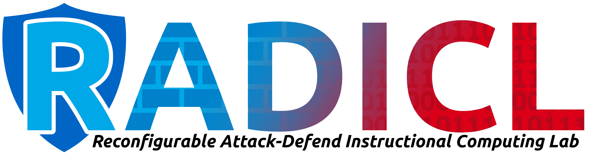
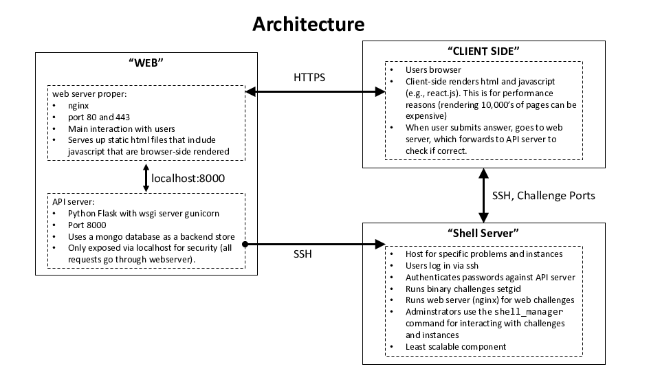

<a name="readme-top"></a>


<!-- PROJECT SHIELDS -->
<!--
*** I'm using markdown "reference style" links for readability.
*** Reference links are enclosed in brackets [ ] instead of parentheses ( ).
*** See the bottom of this document for the declaration of the reference variables
*** for contributors-url, forks-url, etc. This is an optional, concise syntax you may use.
*** https://www.markdownguide.org/basic-syntax/#reference-style-links
-->
[![Contributors][contributors-shield]][contributors-url]
[![Forks][forks-shield]][forks-url]
[![Stargazers][stars-shield]][stars-url]
[![Issues][issues-shield]][issues-url]
[![MIT License][license-shield]][license-url]
[![LinkedIn][linkedin-shield]][linkedin-url]


<!-- PROJECT LOGO -->
<br />
<div align="center">
  <a href="https://github.com/taeganw/RadiclCTF/">
    
  </a>

  <h3 align="center">RadiclCTF</h3>

  <p align="center">
    A platform for students to design, implement and evaluate exercises that test their understanding of core concepts in industrial control systems cybersecurity, answering the need for more interactive education methods.
    <br />
    <a href="https://github.com/picoCTF/picoCTF/"><strong>Explore PicoCTF »</strong></a>
    <br />
    <br />
    <a href="https://github.com/taeganw/RadiclCTF/blob/master/RadiclCTF.pdf">Review the Research</a>
    ·
    <a href="https://youtu.be/mGszRJNa6nk">View a Demo</a>
  </p>
</div>


<!-- TABLE OF CONTENTS -->
<details>
  <summary>Table of Contents</summary>
  <ol>
    <li>
      <a href="#about-the-project">About The Project</a>
      <ul>
        <li><a href="#built-with">Built With</a></li>
      </ul>
    </li>
    <li>
      <a href="#picoctf">picoCTF</a>
      <ul>
        <li><a href="#quick-start">Quick Start</a></li>
        <li><a href="#next-steps">Next Steps</a></li>
        <li><a href="#walkthrough">Walkthrough</a></li>
        <li><a href="#picoctf-web"> picoCTF Web</a></li>
        <li><a href="#picoctf-shell-manager"> picoCTF Shell Manager</a></li>
        <li><a href="#picoctf-compatible-problems"> picoCTF Compatible Problems</a></li>
        <li><a href="#ansible-for-automated-system-administration">Ansible for Automated System Administration</a></li>
        <li><a href="#running-your-own-competition">Running Your Own Competition</a></li>
      </ul>
    </li>
    <li><a href="#license">License</a></li>
    <li><a href="#acknowledgments">Acknowledgments</a></li>
  </ol>
</details>


<!-- ABOUT THE PROJECT -->
## About The Project
To address the nationwide workforce shortage of skilled and educated cyber-informed engineers, we must develop low-cost and highly effective resources for industrial control systems education and training. College curricula in technology management, cybersecurity, and computer science aim to build students' computational and adversarial thinking abilities but are often done only through theory and abstracted concepts. To better a student's understanding of industrial control system applications, post-secondary institutions can use gamification to increase student interest through an interactive, user-friendly, hands-on experience. RADICL CTF can provide post-secondary institutions with new opportunities for low-cost, guided exercises for industrial control system (ICS) education to help students master adversarial thinking. Based on an extension to picoCTF, RADICL CTF is a platform for students to design, implement and evaluate exercises that test their understanding of core concepts in industrial control systems cybersecurity, answering the need for more interactive education methods.

<p align="right">(<a href="#readme-top">back to top</a>)</p>


### Built With

This section should list any major frameworks/libraries used to bootstrap your project. Leave any add-ons/plugins for the acknowledgements section. Here are a few examples.

* [PicoCTF](https://picoctf.org/)
* [Python](http://www.python.org)
* [Ansible](http://www.ansible.com)
* [Docker](https://www.docker.com/)


<p align="right">(<a href="#readme-top">back to top</a>)</p>


## picoCTF
<!-- Quick Start -->
### Quick Start


The following steps will use [Vagrant](https://www.vagrantup.com/) to get you
quickly up and running with the picoCTF platform by deploying the code base to
two local virtual machines. You can read more about using `vagrant` in our
[documentation](./docs/vagrant.md)

```
git clone https://github.com/picoCTF/picoCTF.git
cd picoCTF
vagrant up
```

These commands perform the following:

1. Get the source code at the most recent development state (`git`)
2. Change into the source code directory (`cd`)
3. Bring up a local copy of the picoCTF platform (`vagrant`)
    - This will take approximately 30-45 minutes based on your network speed as
    vagrant downloads a base virtual machine and all the components to install
    the platform. This is a one-time, upfront cost. Obligatory [xkcd][].

[xkcd]:https://xkcd.com/303/

Now that your local copy of picoCTF has been deployed:

4. Browse to http://192.168.2.2/
5. Login with the automatically created administrator account
    - user: `ctfadmin`
    - password: `dev`

Make your first change. For example to change "CTF Placeholder" in the
navigation bar:

6. Edit `picoCTF-web/web/_includes/header.html`
7. Update the running site.
    - If you have `ansible` installed locally on your machine it is as
    ```
    cd infra_local
    ansible-playbook site.yml --limit web --tags web-static
    ```
    - If you do not, then you can run the same command from within the virtual
    machine:
    ```
    vagrant ssh web
    cd /picoCTF/infra_local
    ansible-playbook site.yml --limit web --tags web-static
    ```

Then check out the [infra_local](./infra_local) directory for more information
on using the local development environment in a more efficient manner.

### Next Steps

Interested in development? Check out the notes in [infra_local][il].

Interested in running a public event? Check out the notes in [infra_remote][ir]
and the [Running Your Own Competition][r] section of this document.

The documentation has more information on [Alternative Deployments][ad].

Continue reading for more information on the picoCTF project.

[il]:./infra_local
[ir]:./infra_remote
[r]:/README.md#running-your-own-competition
[ad]:./docs/alt_deployment.md


## Project Overview

This project is broken down into a few discrete components that compose to build
a robust and full featured CTF platform. Specifically the project consists of
the following:

1. [picoCTF-web](./picoCTF-web). The website and all APIs.
2. [picoCTF-shell](./picoCTF-shell). Where users go to solve challenges.
3. [problems](./problems). CTF problem source code.
4. [ansible](./ansible). Used for configuring machines.
5. Infrastructure Examples. Different ways to deploy the picoCTF platform
  - [infra_local][il]. Local infrastructure (Vagrant)
  - [infra_remote][ir]. Remote infrastructure (Terraform)

### Walkthrough

Once you bring everything up, the main flow between components is:



Here is a walkthrough:
1. The user connects to the "Web Server". This is an nginx server.
   - The nginx server serves up content in [picoCTF-web/web](picoCTF-web/web).
   - The nginx server only serves up static HTML files.
   - Most HTML files contain javascript, which is rendered browser-side for
     speed.
   - The browser rendering in turn makes requests to a REST-ful like API `/api/`
     to nginx. Requests to `/api` are forwarded to an API server (running on the
     same host for development).
   - There is a special interface called `/admin`, which is used by the admin to
     connect to new shell servers.
2. The users `/api` request is forwarded to the API server.
   - The API server is a python flask server with code under
     [picoCTF-web/api](picoCTF-web/api)
   - There is an API for adding users, checking passwords, etc.
   - There is an API for serving up challenges, checking flags, etc.
   - The API keeps track of user score and membership to teams.
3. A user can `ssh` to the shell server.
   - The shell server is loaded with problems, with examples in
     [problems](problems/).
   - The web server connects to the shell server and retrieves a JSON file
     containing problem instance location, point value, etc.
   - The web server authenticates users using password data stored and via the
     API.

Some important terminology:
+ A _problem_ is a logical CTF problem. (Sometimes called a _challenge_)
  + Solving a problem gives a user points.
  + A problem can be _locked_ or _unlocked_ for a user.
  + Super important: problems *do not* have flags. They are purely logical.
+ A _problem instance_, or _instance_ for short, is a generated version of a
  challenge to be solved by a user.
  + A single problem can have instances `inst_1`, `inst_2`, ..., `inst_n`. Each
    instance has its own flag `flag_1`, `flag_2`, ..., `flag_n`
  + Users are assigned specific problem instances, and they are expected to
    submit only their flag. For example, if user Foo has instance `inst_1`, only
    `flag_1` is a valid flag (aa separate instance flag `flag_2` is not valid)
  + Instances were invented to help combat flag sharing. If player Foo has been
    assigned `inst_1` but submits `flag_2`, then whomever has `inst_2` shared
    their flag. There may be legitimate reasons for flag sharing, but in many
    competitions it is indicative of cheating.
  + Instances are generated from a _template_. Think of it like templating in a
    web framework. For example, a buffer overflow problem may template the
    specific buffer size so a solution for `inst_i` will not work for `inst_j`.

### picoCTF-web

The competitor facing web site, the API for running a CTF, and the management
functionality for CTF organizers. The development [Vagrantfile](./Vagrantfile)
deploys picoCTF-web to a virtual machine (web) at http://192.168.2.2/. If you
want to modify the look and feel of the website, this is the place to start.

### picoCTF-shell-manager

The tools to create, package, and deploy challenges for use with the picoCTF
platform. This supports the deployment of auto-generated challenge instances and
provides competitors shell access to aid in challenge solving. The development
[Vagrantfile](./Vagrantfile) deploys the shell-server as a second virtual
machine (shell) at http://192.168.2.3/. If you want to modify challenge
deployment primitives, this is the place to start.

### picoCTF Compatible Problems

Example challenges that are compatible with the picoCTF platform. These
challenges can be easily shared, deployed, or adapted for use in a CTF. The
development [Vagrantfile](./Vagrantfile) installs these examples to the shell
server and loads them into the web interface. If you want to see how to create
challenges or leverage the hacksport library, this is the place to start.

### Ansible for Automated System Administration

The tool we use to install, configure, deploy, and administer the picoCTF
platform is [Ansible](https://www.ansible.com/). This allows us to create
flexible, parameterized, automated playbooks and roles that apply across
development, staging, and production environments. If you want to modify way the
platform is configured, this is the place to start.

### Running Your Own Competition

If you are looking to run your own CTF competition, you should:
1. Make sure you can bring up the local infrastructure (`Vagrantfile`
   and [infra_local][il])
1. Make sure you understand how to deploy the infrastructure via `terraform` and
   `ansible` ([infra_remote][ir]).
2. You can reskin the look and feel of the site by editing the
   [picoCTF-web/web](picoCTF-web/web) javascript and HTML code.
3. To enable password reset emails, log in using the site administrator
   account and configure Email under Management > Configuration.
4. You should start writing your own problems, loading them into the shell
   server, and syncing the web server problem set with the shell server via the
   `/admin` URL endpoint.

Do not underestimate the importance of spending significant time in problem
development. Our internal system is:
1. We form a working group for the contest.
2. We often vet problem ideas with the group before implementation.
3. Implement and deploy. Hardcode nothing (or as little as possible).
4. *THE KEY STEP:* Play test! Often the initial problem will have an
   intellectual leap built-in that's obvious to the creator but to no one
   else. Play testing makes sure the problem is coherent, self-contained, and
   fun.

For more on running events see:
- [The Many Maxims of Maximally Effective CTFs][maxims]
- [PPP's Suggestions For Running a CTF][ppp]

[maxims]:https://captf.com/maxims.html
[ppp]:https://github.com/pwning/docs/blob/master/suggestions-for-running-a-ctf.markdown

<!-- LICENSE -->
## License

Distributed under the MIT License. See `LICENSE.txt` for more information.

<p align="right">(<a href="#readme-top">back to top</a>)</p>


<!-- ACKNOWLEDGMENTS -->
## Acknowledgments

Use this space to list resources you find helpful and would like to give credit to. I've included a few of my favorites to kick things off!

* Dr. Michael Haney
* Tiffany Fhurmann
* RADICL Lab Idaho Falls
* picoCTF - Carnegie Mellon

<p align="right">(<a href="#readme-top">back to top</a>)</p>


<!-- MARKDOWN LINKS & IMAGES -->
<!-- https://www.markdownguide.org/basic-syntax/#reference-style-links -->
[contributors-shield]: https://img.shields.io/github/contributors/othneildrew/Best-README-Template.svg?style=for-the-badge
[contributors-url]: https://github.com/othneildrew/Best-README-Template/graphs/contributors
[forks-shield]: https://img.shields.io/github/forks/othneildrew/Best-README-Template.svg?style=for-the-badge
[forks-url]: https://github.com/othneildrew/Best-README-Template/network/members
[stars-shield]: https://img.shields.io/github/stars/othneildrew/Best-README-Template.svg?style=for-the-badge
[stars-url]: https://github.com/othneildrew/Best-README-Template/stargazers
[issues-shield]: https://img.shields.io/github/issues/othneildrew/Best-README-Template.svg?style=for-the-badge
[issues-url]: https://github.com/othneildrew/Best-README-Template/issues
[license-shield]: https://img.shields.io/github/license/othneildrew/Best-README-Template.svg?style=for-the-badge
[license-url]: https://github.com/othneildrew/Best-README-Template/blob/master/LICENSE.txt
[linkedin-shield]: https://img.shields.io/badge/-LinkedIn-black.svg?style=for-the-badge&logo=linkedin&colorB=555
[linkedin-url]: https://linkedin.com/in/taegan-w-b17b7a91

